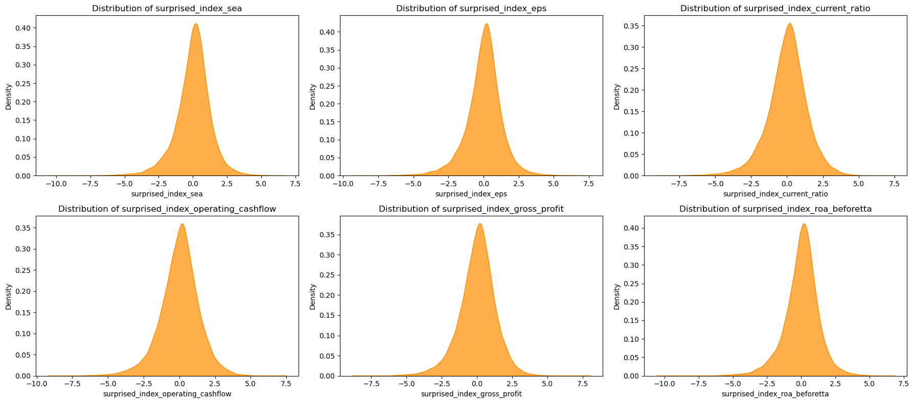
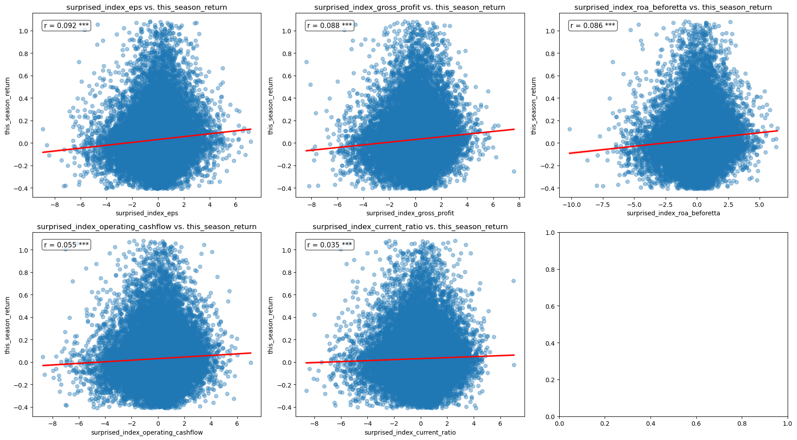

#  Surprise Index Investment Strategy


## 一、策略介紹
在這次研究中，我們發現財務報表驚奇程度對於個股超額報酬的遞延性，並用此特性衍生出一個量化因子投資策略。運用多元回歸、隨機森林模型來動態搭配每一季所持有股票多空組合，並在訓練期跟測試期都獲得優於市場的報酬。
This is a quantitative investment strategy driven by the surpriseness of company's key financial index, using both linear and machine learning model to build an risk neutral stock seletion strategy

以下是策略關鍵變數的衡量方法:
參考 _Piotroski F-score_，我們將財報的驚奇程度用六個關鍵財務指標來衡量，分別是稅前ROA、EPS、Gross profit、Operatiin Cash flow、current ratio.

並且分別進行以下計算轉換為驚奇指數:   
   - _驚奇指數 = 本季與去年度同季財務指標變化量 − 上季財報公布日後一天⾄財報⽇前一天的股價報酬率_

在計算出五個財務指標的驚奇指標後，我們將用**多元回歸模型**和**隨機森林模型**來給予該季財報驚奇分數。

## 二、資料前處理

### 函式庫
````python
import yfinance as yf
import statsmodels.api as sm
import numpy as np
import pandas as pd
import matplotlib.pyplot as plt
from sklearn.linear_model import LinearRegression
from scipy.stats import pearsonr
from tqdm import tqdm 
from sklearn.ensemble import RandomForestClassifier
from sklearn.model_selection import train_test_split
from sklearn.metrics import accuracy_score, confusion_matrix, classification_report
import seaborn as sns
````
### 物件導向程式設計：驚奇指標計算class

這個 SurpriseAnalyzer 類別是一個針對台灣股票進行財報「驚奇指標分析」的工具。給定一家公司名稱，它會自動讀取相關財報數據（如 EPS、毛利率、ROA 等）與股價，計算財報公布前後的季報酬，並標準化各指標變動，進一步推算每季的「驚奇指標」──即財報表現與市場預期落差。
````python

class SurpriseAnalyzer:
    def __init__(self, stock_name):
        """
        初始化分析器，設定公司名稱，讀取基礎資料
        """
        self.stock_name = stock_name
        self._stock_code = None
        self._market_index = None
        self._price_data = None
        self.df = None  # 儲存最終包含驚奇指標的 DataFrame
        self._load_stock_code()
        self._load_price_data()
        self._cal_this_next_season_return()
    
    def __repr__(self):
        """
        顯示分析物件的基本資訊與狀態
        """
        return (f"EPSAnalyzer(stock_name='{self.stock_name}', "
                f"stock_code='{self._stock_code}', "
                f"rows={len(self.df) if self.df is not None else 0}, "
                f"columns={len(self.df.columns) if self.df is not None else 0})")

    def _get_stock_code(self):
        """
        根據股票名稱，從 EPS 檔中取得股票代號並加上 '.TW'。
        """
        df = pd.read_csv("C:/Users/USER/Downloads/2010至今eps.csv")
        stock_code = df[df["名稱"] == self._stock_name]["代號"]
        return str(stock_code.values[0]) + '.TW'

    def _download_market_data(self):
        """
        使用 yfinance 下載指定股票的每日股價資料。
        """
        return yf.download(tickers=self._stock_code, interval="1d")

    def _load_financial_data(self):
        """
        載入所有財報指標資料，包括 EPS、流動比率等。
        """
        return {
            'eps': pd.read_csv("data/2010至今eps.csv"),
            'current_ratio': pd.read_csv("data/curren_ratio.csv"),
            'gross_profit': pd.read_csv("data/gross_profit.csv"),
            'operating_cashflow': pd.read_csv("data/operating_cashflow.csv"),
            'roa_beforetta': pd.read_csv("data/roa_beforetta.csv")
        }

    def _load_report_dates(self):
        """
        載入財報公布日期資料。
        """
        return pd.read_csv("C:/Users/USER/Downloads/財報公布日.csv")

    def _extract_time_series(self, df, name):
        """
        從指定資料框中抽出該股票的時間序列資料，並轉為 datetime index。
        """
        ts = df[df["名稱"] == self._stock_name].T.iloc[2:].sort_index()
        ts.columns = [name]
        ts.index = pd.DatetimeIndex(ts.index)
        return ts

    def _cal_this_next_season_return(self):
        """
        整合所有財報指標與財報公布日，建立主分析資料框 df。
        包括計算財報公布日前一季報酬與財報後報酬。
        """
        df = self._extract_time_series(self._financial_data['eps'], "eps")
        df["current_ratio"] = self._extract_time_series(self._financial_data['current_ratio'], "current_ratio")
        df["gross_profit"] = self._extract_time_series(self._financial_data['gross_profit'], "gross_profit")
        df["operating_cashflow"] = self._extract_time_series(self._financial_data['operating_cashflow'], "operating_cashflow")
        df["roa_beforetta"] = self._extract_time_series(self._financial_data['roa_beforetta'], "roa_beforetta")

        date = self._report_dates[self._report_dates["名稱"] == self._stock_name].T.iloc[2:].sort_index()
        df["date"] = pd.DatetimeIndex(date.iloc[:, 0])

        df["past_season_return"] = np.nan
        df["observed_period"] = None
        df["this_season_return"] = np.nan

        for i in range(1, len(df) - 1):
            start_date = df.iloc[i - 1]["date"] + pd.Timedelta("1d")
            end_date = df.iloc[i]["date"]

            price_series = pd.to_numeric(self._market_index, errors='coerce')
            past_period = price_series.loc[start_date:end_date].dropna()

            if not past_period.empty:
                returns = (past_period.iloc[-1] - past_period.iloc[0]) / past_period.iloc[0]
                this_date = df.iloc[i]["date"]
                next_date = df.iloc[i + 1]["date"]
                observed_period = self._market_data.loc[this_date:next_date].dropna()

                date_index = df.index[i]
                df.at[date_index, "past_season_return"] = returns
                df.at[date_index, "observed_period"] = observed_period

                if isinstance(observed_period, pd.DataFrame) and len(observed_period) > 2:
                    df.at[date_index, "this_season_return"] = (observed_period["Close"].iloc[-1] - observed_period["Open"].iloc[0]) / observed_period["Open"].iloc[0]
                else:
                    df.at[date_index, "this_season_return"] = np.nan

        return df

    def _calculate_surprise_index(self, df, indicator):
        df = df.copy()
        df["growth"] = df[indicator].pct_change()
        df["month"] = df.index.month
        df["seasonal_gfgrowth"] = df.groupby("month")["growth"].diff()
        df["seasonal_growth"] = df.groupby("month")[indicator].diff()
        df["seasonal_perform_index"] = df["seasonal_growth"]

        df["standardized_past_season_return"] = (df["past_season_return"] - np.mean(df["past_season_return"])) / np.std(df["past_season_return"])
        df["standardized_perform_index"] = (df["seasonal_perform_index"] - np.mean(df["seasonal_perform_index"])) / np.std(df["seasonal_perform_index"])
        df["standardized_growth"] = (df["growth"] - np.mean(df["growth"])) / np.std(df["growth"])

        surprised_index = df["standardized_perform_index"] - df["standardized_past_season_return"]
        return surprised_index

    def _analyze(self):
        self.df["surprised_index_eps"] = self._calculate_surprise_index(self.df, "eps")
        self.df["surprised_index_current_ratio"] = self._calculate_surprise_index(self.df, "current_ratio")
        self.df["surprised_index_operating_cashflow"] = self._calculate_surprise_index(self.df, "operating_cashflow")
        self.df["surprised_index_gross_profit"] = self._calculate_surprise_index(self.df, "gross_profit")
        self.df["surprised_index_roa_beforetta"] = self._calculate_surprise_index(self.df, "roa_beforetta")
        return self.df
    

````
### 物件輸出範例：以台泥為例
如果我們在輸入台泥，SurpriseAnalyzer會根據上述邏輯計算出台泥 2011-Q3 到 2024-Q3 每一季的五個驚奇指標 (本研究特徵變數)、和下季股價報酬率(目標變數)，並回傳一個以財報公布次數為樣本數的dataframe。這樣做的好處是可以先忽視每家上市櫃公司的異質性，方便做統計檢驗。
其他類別變數包含：公司名稱、產業別、子產業別，方便日後子樣本回歸和回測使用。
````python
analyzer = SurpriseAnalyzer("台泥")
result = analyzer.analyze()
````
| index | stock | date       | industry | sub_industry | past_season_return | this_season_return | capital         | surprised_index_eps | surprised_index_gross_profit | surprised_index_roa_beforetta | surprised_index_operating_cashflow | surprised_index_current_ratio | observed_period     |
|-------|-------|------------|----------|---------------|--------------------|---------------------|------------------|----------------------|-------------------------------|-------------------------------|-------------------------------|----------------------------|----------------------|
| 306   | 台泥  | 2011-11-08 | 水泥製造 | 水泥製造      | -0.051613          | -0.083555           | 77,511,817,420   | 0.607769             | 0.760453                      | 0.426872                      | 1.46689                      | 0.25609                    | Price Close High Low ... |
| 307   | 台泥  | 2012-03-30 | 水泥製造 | 水泥製造      | -0.062415          | 0.211845            | 77,511,817,420   | 0.177009             | -0.237003                     | 0.183163                      | -0.647645                    | 0.208716                   | Price Close High Low ... |
| 308   | 台泥  | 2013-05-15 | 水泥製造 | 水泥製造      | 0.218931           | 0.038461            | 77,511,817,420   | -1.796884            | -2.58713                      | -2.33914                      | -1.083479                    | -3.069321                  | Price Close High Low ... |
| 309   | 台泥  | 2013-08-14 | 水泥製造 | 水泥製造      | 0.022766           | 0.053985            | 77,511,817,420   | -0.169579            | -0.745016                     | -1.62934                      | -0.745731                    | -0.956139                  | Price Close High Low ... |
| 313   | 台泥  | 2013-08-14 | 水泥製造 | 水泥製造      | 0.022766           | 0.053985            | 77,511,817,420   | 0.192859             | 0.661097                      | 0.793124                      | 0.802544                     | -0.196808                  | Price Close High Low ... |
| 314   | 台泥  | 2013-11-14 | 水泥製造 | 水泥製造      | 0.059431           | 0.161928            | 77,511,817,420   | 0.987591             | 0.825564                      | 1.283005                      | -0.709972                    | -1.556281                  | Price Close High Low ... |
| 315   | 台泥  | 2014-03-31 | 水泥製造 | 水泥製造      | 0.107185           | -0.042283           | 77,511,817,420   | -0.29677             | -0.76883                      | 0.328945                      | -1.251529                    | -0.902194                  | Price Close High Low ... |
| 316   | 台泥  | 2014-05-15 | 水泥製造 | 水泥製造      | -0.052301          | 0.091589            | 77,511,817,420   | 1.219027             | 1.450653                      | 1.479293                      | 1.943531                     | 0.844266                   | Price Close High Low ... |
| 317   | 台泥  | 2014-08-14 | 水泥製造 | 水泥製造      | 0.053538           | -0.016393           | 77,511,817,420   | 0.263899             | 0.034964                      | 0.569898                      | -1.079002                    | -0.686497                  | Price Close High       |

### 跑回圈計算所有上市櫃公司驚奇指標
````python
# 載入股票名稱清單
df = pd.read_csv("C:/Users/USER/Downloads/2010至今eps.csv")
concat_df = pd.DataFrame()

# 對所有股票進行分析
for stock_name in tqdm(df["名稱"], desc="分析進度"):
    try:
        analyzer = SurpriseAnalyzer(stock_name)
        result = analyzer.analyze()
        result["stock"] = stock_name  # 加上公司標籤
        concat_df = pd.concat([concat_df, result])
    except Exception as e:
        print(f" {stock_name} 發生錯誤：{e}")
````
### 變數分布型態


## 三、相關性檢驗
### 1. 📉 Linear Model for Initial Variable Filtering
We first use a simple linear regression model to detect preliminary relationships between surprise indices and stock/sector returns.
````python
# 定義用來的特徵欄位
X_cols = [
    "surprised_index_gross_profit",
    "surprised_index_current_ratio",
    "surprised_index_eps",
    "surprised_index_roa_beforetta",
    "surprised_index_operating_cashflow",
]
# 去極值
cd = trim_outliers_joint(df, X_cols + ["this_season_return"])
cd = cd.dropna()

# X, y
X = cd[X_cols]
y = cd["this_season_return"]

# 建立並訓練模型
model = LinearRegression()
model.fit(X, y)

# 預測
y_pred = model.predict(X)
````
  

-  **預測與真實的相關係數 r = 0.1007, p-value = 8.374e-91**\
  

### 2.各變數相關性
  

---

### 3. Industry-Level Correlation Analysis
We examine how different sectors respond to surprise indices.


---

### 4. Feature Importance via Random Forest
We apply Random Forest to further assess variable importance and capture nonlinear relationships.
````python
X_cols = [
    "eps",
    "current_ratio",
    "surprised_index_eps",
    "surprised_index_current_ratio",
    "surprised_index_gross_profit",
    "surprised_index_operating_cashflow",
    "surprised_index_roa_beforetta",
    "industry_dummy"
]

# Step 1: 轉換目標變數為三分類 
# 分成：下跌（0）、持平（1）、上漲（2）
quantiles = df["this_season_return"].quantile([0.33, 0.66]).values
def classify_return(x):
    if x <= quantiles[0]:
        return 0  # 下跌
    elif x <= quantiles[1]:
        return 1  # 持平
    else:
        return 2  # 上漲

df["y_class"] = df["this_season_return"].apply(classify_return)

# Step 2: 建立 X 和 y
X = df[X_cols]
y = df["y_class"]

df_model = pd.concat([X, y, df["this_season_return"]], axis=1).dropna()
X = df_model[X_cols]
y = df_model["y_class"]

# Step 3: 切分資料 
X_train, X_test, y_train, y_test = train_test_split(X, y, test_size=0.35)

# Step 4建立並訓練分類模型
clf = RandomForestClassifier(n_estimators=100, min_samples_leaf=3) #min_sample_leaf設3防止overfitting
clf.fit(X_train, y_train)

````


- **Random Forest results**\
  \
  可以看到f-score顯著大於0.33 表示有一定預測能力。
- **Variable Importance**\
  \
  與線性模型結果一致，可以確認營收指標的預測能力較為佳。
  

- **Feature Heatmap**\
  \
  進一步從分類熱度圖可以看出，隨機森林模型在捕捉預測優質股票的表現比線性模型較佳。

---

## 三、策略建構
### 1. Simple screening
在驗證驚奇指標對於單季報酬有預測能力以後，我們先使用不同預測分數的門檻值來動態更新投資組合。\
這邊用for loop跑過回測期間的每一天，如果當天有公司公布財務報表，以下程式碼就會用他對應的驚奇指數來判斷是否將其加入投資組合，每次加入為期一季。最後再簡單平均當天持有的所有股票報酬率。
````python
# 初始化
returns_80    = pd.Series(dtype='float64')
returns_50abv = pd.Series(dtype='float64')
returns_50blw = pd.Series(dtype='float64')
returns_20    = pd.Series(dtype='float64')

# quantiles
pr80 = np.quantile(y_pred, 0.8)
pr50 = np.quantile(y_pred, 0.5)
pr20 = np.quantile(y_pred, 0.2)

# 三個投組的股票列表
portfolio_80 = np.array([])
portfolio_50abv = np.array([])
portfolio_50blw = np.array([])
portfolio_20 = np.array([])

# 計算每日投組平均報酬的函數
def get_return(portfolio, date):
    if date not in return_df.index:
        return np.nan
    # 避免 portfolio 中有不存在的股票代碼
    valid = [s for s in portfolio if s in return_df.columns]
    if not valid:
        return np.nan
    return return_df.loc[date, valid].mean()

# 逐日更新
for i in date:

    today_new = cd.loc[cd["date"] == i].copy()

    # 移除今天剛公告的股票
    portfolio_80     = portfolio_80[~np.isin(portfolio_80, today_new["stock"].values)]
    portfolio_50abv  = portfolio_50abv[~np.isin(portfolio_50abv, today_new["stock"].values)]
    portfolio_50blw  = portfolio_50blw[~np.isin(portfolio_50blw, today_new["stock"].values)]
    portfolio_20     = portfolio_20[~np.isin(portfolio_20, today_new["stock"].values)]

    # 分別挑出今天要加入的股票
    buy80 = today_new["return_pred"] >= pr80
    buy50abv = today_new["return_pred"] >= pr50
    buy50blw = today_new["return_pred"] <= pr50
    buy20 = today_new["return_pred"] <= pr20


     # 分別加入新的股票
    portfolio_80     = np.concatenate([portfolio_80, today_new.loc[buy80, "stock"].values])
    portfolio_50abv  = np.concatenate([portfolio_50abv, today_new.loc[buy50abv, "stock"].values])
    portfolio_50blw  = np.concatenate([portfolio_50blw, today_new.loc[buy50blw, "stock"].values])
    portfolio_20     = np.concatenate([portfolio_20, today_new.loc[buy20, "stock"].values])

    # 計算三組投組的回報
    returns_80.loc[i] = get_return(portfolio_80, i)
    returns_50abv.loc[i] = get_return(portfolio_50abv, i)
    returns_50blw.loc[i] = get_return(portfolio_50blw, i)
    returns_20.loc[i] = get_return(portfolio_20, i)
````
- **Screening Strategy Performance**\
  

- **Return Comparison**\
  

- **Sharpe Ratio Comparison**\
  

---

## 2. Final Strategy: Long-Short Top/Bottom 20%

We select the **top 20%** and **bottom 20%** ranked stocks to build a **market-neutral long-short strategy** in both periods.

- #### step 1.
We split the timeline into training and testing periods to ensure robustness:

    - **Training period**: 2011–2021/10  
    - **Testing period**: 2021/11–2025/01
  
    - 用training period 資料重新訓練:
````python
cd_train = cd.loc[cd["date"]<"2022-01"] #訓練資料 2011~2021/10

# X, y
x = cd_train[X_cols]
y = cd_train["this_season_return"]

# 建立並訓練模型
model = LinearRegression()
model.fit(x, y)

X2 = cd[X_cols]
# 預測
y_pred = model.predict(X2)
cd["return_pred"] = y_pred
````


- #### step 2.
回測策略 (參考3-1的程式碼)

- **Final Strategy Backtest**\
  

---
- Maximum drawdown 


---

#### 📈 Final Strategy Backtest (Train vs. Test)

| Metric                | Train (2011–2021/10) | Test (2021/11–2025/01) |
|------------------------|----------------------|-------------------------|
| Annualized Return      | 0.0938               | 0.1699                  |
| Annualized Volatility  | 0.0580               | 0.0694                  |
| Sharpe Ratio           | 1.5733               | 2.2957                  |
| Cumulative Return      | 0.2950               | 4.5512                  |

---

## ▶️ Run This Project

```bash
git clone https://github.com/your_username/suprise-index-investment-strategy.git
cd suprise-index-investment-strategy
jupyter notebook strategy_pipeline.ipynb
