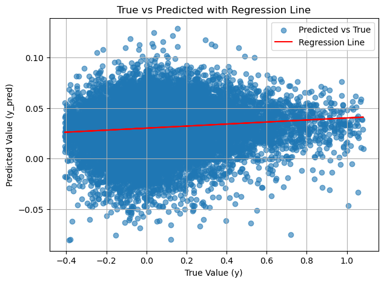
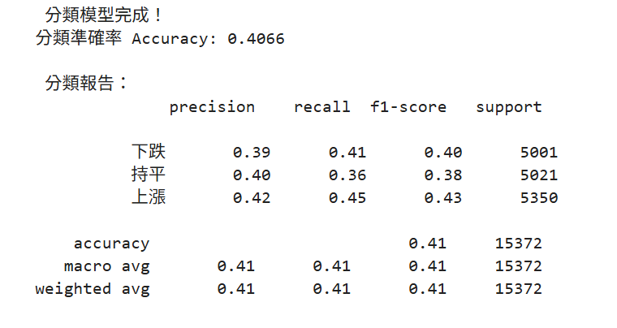
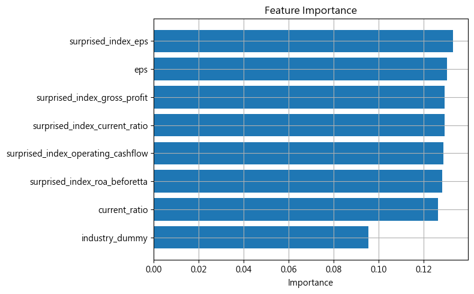
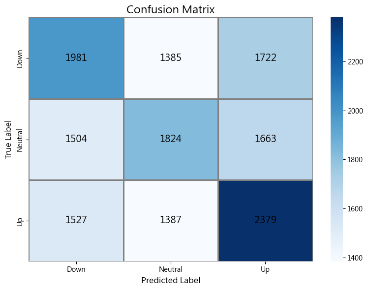
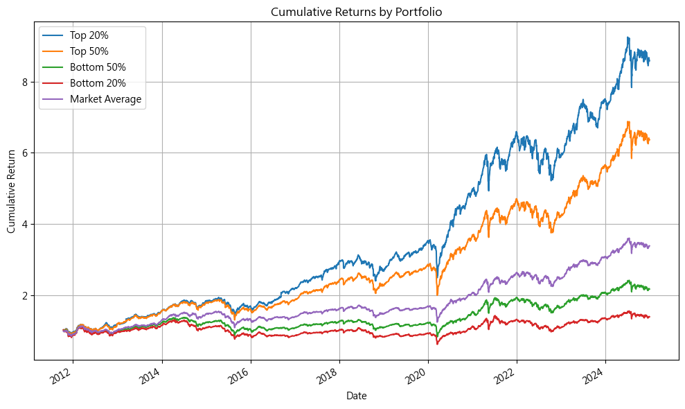
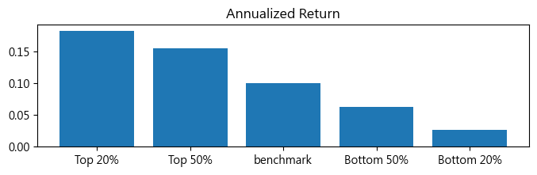
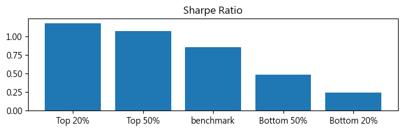
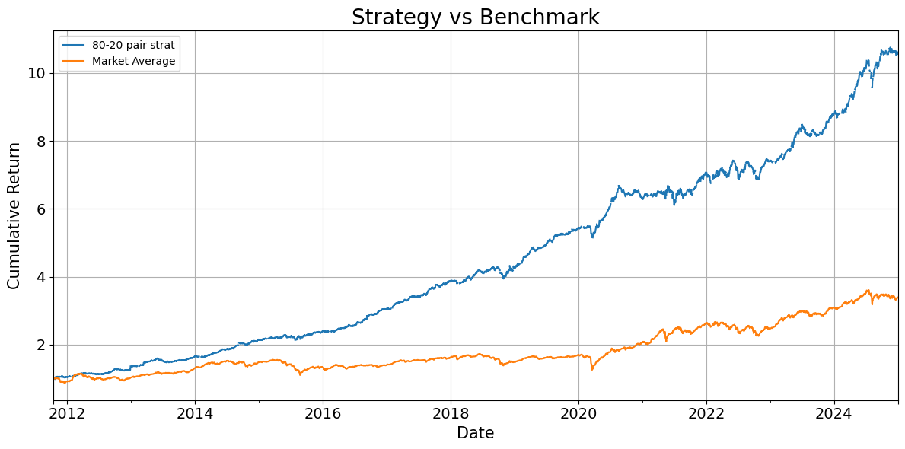
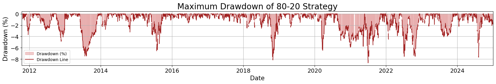

#  Surprise Index Investment Strategy

This is a quantitative investment strategy driven by the surpriseness of company's key financial index, using both linear and machine learning model to build an risk neutral stock seletion strategy

## 🧭 Strategy Workflow

## 二、相關性檢驗
### 1. 📉 Linear Model for Initial Variable Filtering
We first use a simple linear regression model to detect preliminary relationships between surprise indices and stock/sector returns.
````python
# 定義用來的特徵欄位
X_cols = [
    "surprised_index_gross_profit",
    "surprised_index_current_ratio",
    "surprised_index_eps",
    "surprised_index_roa_beforetta",
    "surprised_index_operating_cashflow",
]
# 去極值
cd = trim_outliers_joint(df, X_cols + ["this_season_return"])
cd = cd.dropna()

# X, y
X = cd[X_cols]
y = cd["this_season_return"]

# 建立並訓練模型
model = LinearRegression()
model.fit(X, y)

# 預測
y_pred = model.predict(X)
````
-**預測與真實的相關係數 r = 0.1007, p-value = 8.374e-91**\



---

### 2. Industry-Level Correlation Analysis
We examine how different sectors respond to surprise indices.


---

### 3. Feature Importance via Random Forest
We apply Random Forest to further assess variable importance and capture nonlinear relationships.
````python
X_cols = [
    "eps",
    "current_ratio",
    "surprised_index_eps",
    "surprised_index_current_ratio",
    "surprised_index_gross_profit",
    "surprised_index_operating_cashflow",
    "surprised_index_roa_beforetta",
    "industry_dummy"
]

# Step 1: 轉換目標變數為三分類 
# 分成：下跌（0）、持平（1）、上漲（2）
quantiles = df["this_season_return"].quantile([0.33, 0.66]).values
def classify_return(x):
    if x <= quantiles[0]:
        return 0  # 下跌
    elif x <= quantiles[1]:
        return 1  # 持平
    else:
        return 2  # 上漲

df["y_class"] = df["this_season_return"].apply(classify_return)

# Step 2: 建立 X 和 y
X = df[X_cols]
y = df["y_class"]

df_model = pd.concat([X, y, df["this_season_return"]], axis=1).dropna()
X = df_model[X_cols]
y = df_model["y_class"]

# Step 3: 切分資料 
X_train, X_test, y_train, y_test = train_test_split(X, y, test_size=0.35)

# Step 4建立並訓練分類模型
clf = RandomForestClassifier(n_estimators=100, min_samples_leaf=3) #min_sample_leaf設3防止overfitting
clf.fit(X_train, y_train)

````


- **Random Forest results**\
  
  可以看到f-score顯著大於0.33 表示有一定預測能力。
- **Variable Importance**\
  
  與線性模型結果一致，可以確認營收指標的預測能力較為佳。
  

- **Feature Heatmap**\
  
  進一步從分類熱度圖可以看出，隨機森林模型在捕捉預測優質股票的表現比線性模型較佳。

---

## 三、策略建構
### 1. Simple screening
在驗證驚奇指標對於單季報酬有預測能力以後，我們先使用不同預測分數的門檻值來動態更新投資組合。\
這邊用for loop跑過回測期間的每一天，如果當天有公司公布財務報表，以下程式碼就會用他對應的驚奇指數來判斷是否將其加入投資組合，每次加入為期一季。最後再簡單平均當天持有的所有股票報酬率。
````python
# 初始化
returns_80    = pd.Series(dtype='float64')
returns_50abv = pd.Series(dtype='float64')
returns_50blw = pd.Series(dtype='float64')
returns_20    = pd.Series(dtype='float64')

# quantiles
pr80 = np.quantile(y_pred, 0.8)
pr50 = np.quantile(y_pred, 0.5)
pr20 = np.quantile(y_pred, 0.2)

# 三個投組的股票列表
portfolio_80 = np.array([])
portfolio_50abv = np.array([])
portfolio_50blw = np.array([])
portfolio_20 = np.array([])

# 計算每日投組平均報酬的函數
def get_return(portfolio, date):
    if date not in return_df.index:
        return np.nan
    # 避免 portfolio 中有不存在的股票代碼
    valid = [s for s in portfolio if s in return_df.columns]
    if not valid:
        return np.nan
    return return_df.loc[date, valid].mean()

# 逐日更新
for i in date:

    today_new = cd.loc[cd["date"] == i].copy()

    # 移除今天剛公告的股票
    portfolio_80     = portfolio_80[~np.isin(portfolio_80, today_new["stock"].values)]
    portfolio_50abv  = portfolio_50abv[~np.isin(portfolio_50abv, today_new["stock"].values)]
    portfolio_50blw  = portfolio_50blw[~np.isin(portfolio_50blw, today_new["stock"].values)]
    portfolio_20     = portfolio_20[~np.isin(portfolio_20, today_new["stock"].values)]

    # 分別挑出今天要加入的股票
    buy80 = today_new["return_pred"] >= pr80
    buy50abv = today_new["return_pred"] >= pr50
    buy50blw = today_new["return_pred"] <= pr50
    buy20 = today_new["return_pred"] <= pr20


     # 分別加入新的股票
    portfolio_80     = np.concatenate([portfolio_80, today_new.loc[buy80, "stock"].values])
    portfolio_50abv  = np.concatenate([portfolio_50abv, today_new.loc[buy50abv, "stock"].values])
    portfolio_50blw  = np.concatenate([portfolio_50blw, today_new.loc[buy50blw, "stock"].values])
    portfolio_20     = np.concatenate([portfolio_20, today_new.loc[buy20, "stock"].values])

    # 計算三組投組的回報
    returns_80.loc[i] = get_return(portfolio_80, i)
    returns_50abv.loc[i] = get_return(portfolio_50abv, i)
    returns_50blw.loc[i] = get_return(portfolio_50blw, i)
    returns_20.loc[i] = get_return(portfolio_20, i)
````
- **Screening Strategy Performance**\
  

- **Return Comparison**\
  

- **Sharpe Ratio Comparison**\
  

---

## 2. Final Strategy: Long-Short Top/Bottom 20%

We select the **top 20%** and **bottom 20%** ranked stocks to build a **market-neutral long-short strategy** in both periods.
-step 1.
We split the timeline into training and testing periods to ensure robustness:

- **Training period**: 2011–2021/10  
- **Testing period**: 2021/11–2025/01
  
-用training period 資料重新訓練
````python
cd_train = cd.loc[cd["date"]<"2022-01"] #訓練資料 2011~2021/10

# X, y
x = cd_train[X_cols]
y = cd_train["this_season_return"]

# 建立並訓練模型
model = LinearRegression()
model.fit(x, y)

X2 = cd[X_cols]
# 預測
y_pred = model.predict(X2)
cd["return_pred"] = y_pred
````
-step 2.
回測策略 (參考3-1的程式碼)

- **Final Strategy Backtest**\
  

---
-Max drawdown\



---

#### 📈 Final Strategy Backtest (Train vs. Test)

| Metric                | Train (2011–2021/10) | Test (2021/11–2025/01) |
|------------------------|----------------------|-------------------------|
| Annualized Return      | 0.0938               | 0.1699                  |
| Annualized Volatility  | 0.0580               | 0.0694                  |
| Sharpe Ratio           | 1.5733               | 2.2957                  |
| Cumulative Return      | 0.2950               | 4.5512                  |

---

## ▶️ Run This Project

```bash
git clone https://github.com/your_username/suprise-index-investment-strategy.git
cd suprise-index-investment-strategy
jupyter notebook strategy_pipeline.ipynb
