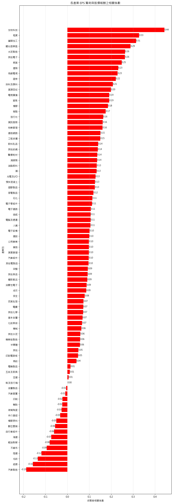

# 📊 Surprise Index Investment Strategy

This is a quantitative investment strategy driven by the surpriseness of company's key financial index, using both linear and machine learning model to build an risk neutral stock seletion strategy

## 🧭 Strategy Workflow

### 1. 📉 Linear Model for Initial Variable Filtering
We first use a simple linear regression model to detect preliminary relationships between surprise indices and stock/sector returns.


---

### 2. 🏭 Industry-Level Correlation Analysis
We examine how different sectors respond to surprise indices.



---

### 3. 🌳 Feature Importance via Random Forest
We apply Random Forest to further assess variable importance and capture nonlinear relationships.

- **Variable Importance Plot**
  

- **Feature Heatmap**
  

---

### 4. 🧪 Strategy Screening: Multiple Thresholds
Using the above signals, we construct multiple strategies based on different percentile thresholds to evaluate effectiveness.

- **Screening Strategy Performance**
  

- **Return Comparison**
  

- **Sharpe Ratio Comparison**
  

---

### 5. ⚖️ Final Strategy: Long-Short Top/Bottom 20%
We select the **top 20%** and **bottom 20%** ranked stocks to build a market-neutral long-short strategy.

- **Final Strategy Backtest**
  

---

### 6. 📉 Risk Analysis
Max drawdown during the backtest period.


---

## 📊 Key Metrics (fill in manually)

| Metric          | Value    |
|-----------------|----------|
| Annual Return   | XX.X %   |
| Max Drawdown    | XX.X %   |
| Sharpe Ratio    | X.XX     |
| Win Rate        | XX %     |
| Backtest Period | 20XX–20XX |

---

## ▶️ Run This Project

```bash
git clone https://github.com/your_username/suprise-index-investment-strategy.git
cd suprise-index-investment-strategy
jupyter notebook strategy_pipeline.ipynb
